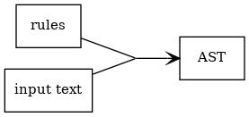
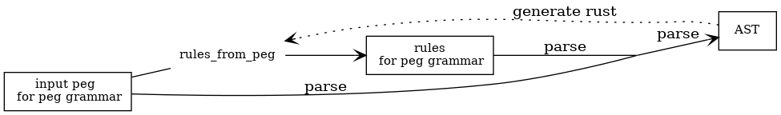

# DynParser

- [repository](https://github.com/jleahred/dynparser)
- [doc](https://docs.rs/dynparser/)
- [rust-crate](https://crates.io/crates/dynparser)

A small and simple Dynamic Parser. It's not a compile time parser.

You can create and modify the grammar on runtime.

A parser is something that takes an `input`, process it with some `rules`
and generate an `AST`

There are also some tools to manage the `AST` (pruning, compacting, flattening...)



In order to create the grammar, you can build a set of rules, or you can use
macros to use a better syntax. But, the easier way, is to use a `peg` grammar.

Then we need an additional step.


More info about the `peg` syntax bellow.

You can also generate `rust` code from rules generated from `peg`.

This allow you to avoid the `peg` step and more...

In fact, in order to use a `peg` grammar, you have to parse it.
How to parse a `peg` grammar? Well, this is a parser, therefore...

More details about it bellow on section (parsing the parser)

## Usage

Add to `cargo.toml`

```toml
[dependencies]
dynparser = "0.4.0"
```

Watch examples below

## Modifications

    0.1.0   First version

    0.2.0   Fixed some errors
            Rules code for peg parsing generated automatically from peg

    0.3.0   pass_through method on AST

    0.4.0   Literals with escape (optional)
            Error constructor on peg grammar
            Flattening the AST

    0.4.2   Fixed error managing error("xxx")
            Working on modules

    0.4.3   Compiled with 2018 edition

## TODO

- move to macros by example 2.0 and improve some
- apply tail recursion parsing rule
- macro for eof

## Basic example

Lets create the next grammar:

```ignore
    main            =   letter letter_or_num+

    letter          =   [a-zA-Z]

    letter_or_num   =   letter
                    /   number

    number          =   [0-9]
```

This grammar will accept a letter, followed from one or more letters or
numbers

### Just from peg


Straightforward...

```rust
    extern crate dynparser;
    use dynparser::{parse, rules_from_peg};

    fn main() {
        let rules = rules_from_peg(
            r#"

    main            =   letter letter_or_num+

    letter          =   [a-zA-Z]

    letter_or_num   =   letter
                    /   number

    number          =   [0-9]

            "#,
        ).unwrap();

        assert!(parse("a2AA456bzJ88", &rules).is_ok());
    }
```

If you want to print more information...

```rust
    extern crate dynparser;
    use dynparser::{parse, rules_from_peg};

    fn main() {
        let rules = rules_from_peg(
            r#"

    main            =   letter letter_or_num+

    letter          =   [a-zA-Z]

    letter_or_num   =   letter
                    /   number

    number          =   [0-9]

            "#,
        ).map_err(|e| {
            println!("{}", e);
            panic!("FAIL");
        })
            .unwrap();

        println!("{:#?}", rules);

        let result = parse("a2Z", &rules);
        match result {
            Ok(ast) => println!("{:#?}", ast),
            Err(e) => println!("Error: {:?}", e),
        };
    }
```

The AST produced will be:

```peg
Rule(
    (
        "main",
        [
            Rule(
                (
                    "letter",
                    [
                        Val(
                            "a"
                        )
                    ]
                )
            ),
            Rule(
                (
                    "letter_or_num",
                    [
                        Rule(
                            (
                                "number",
                                [
                                    Val(
                                        "2"
                                    )
                                ]
                            )
                        )
                    ]
                )
            ),
            Rule(
                (
                    "letter_or_num",
                    [
                        Rule(
                            (
                                "letter",
                                [
                                    Val(
                                        "Z"
                                    )
                                ]
                            )
                        )
                    ]
                )
            )
        ]
    )
)
```

The AST type is:

```rust
pub enum Node {
    Val(String),
    Rule((String, Vec<Node>)),
    EOF,
}
```

You can also work with flattened AST.In several cases will be easier
to visit a flattened AST.

The Flattened AST is:

```rust
pub enum Node {
    Val(String),
    BeginRule(String),
    EndRule(String),
    EOF,
}
}
```

Just it (remember, more information about the peg grammar bellow)

## Example 2

You will configure a set of rules to parse.

The rule is composed of a name followed by an arrow and an expression to be parsed.

A basic example

Lets create the next grammar:

```ignore
   main    =   'a' ( 'bc' 'c'
                   / 'bcdd'
                   / b_and_c  d_or_z
                   )

   b_and_c =   'b' 'c'
   d_or_z  =   'd' / 'z'
```

### Just from peg 2

```rust
extern crate dynparser;
use dynparser::{parse, rules_from_peg};

fn main() {
    let rules = rules_from_peg(
        r#"

    main    =   'a' ( 'bc'  'c'
                    /  'bcdd'
                    / b_and_c  d_or_z
                    )

    b_and_c =   'b'   'c'
    d_or_z  =   'd' / 'z'

        "#,
    ).unwrap();

    assert!(parse("abcz", &rules).is_ok());
    assert!(parse("abcdd", &rules).is_ok());
    assert!(parse("abcc", &rules).is_ok());
    assert!(parse("bczd", &rules).is_err());
}
```

The exit will be the next AST

```ignore
   Rule(
       (
           "main",
           [
               Val(
                   "a"
               ),
               Rule(
                   (
                       "b_and_c",
                       [
                           Val(
                               "b"
                           ),
                           Val(
                               "c"
                           )
                       ]
                   )
               ),
               Rule(
                   (
                       "d_or_z",
                       [
                           Val(
                               "d"
                           )
                       ]
                   )
               )
           ]
       )
   )
```

This is a dynamic parser, you can add rules at execution time.

pending: example

### Generating the rules by hand with macros

You can create this grammar and parse the string "abcd" with macros like:

```rust
#[macro_use]
extern crate dynparser;
use dynparser::parse;

fn main() {
    let rules = rules!{
       "main"   =>  and!{
                        lit!("a"),
                        or!(
                            and!(lit!("bc"), lit!("c")),
                            lit!("bcdd"),
                            and!(
                                ref_rule!("b_and_c"),
                                ref_rule!("d_or_z")
                            )
                        )
                    },
        "b_and_c"  => and!(lit!("b"), lit!("c")),
        "d_or_z"  => or!(lit!("d"), lit!("z"))
    };

    let result = parse("abcd", &rules);
    match result {
        Ok(ast) => println!("{:#?}", ast),
        Err(e) => println!("Error: {:?}", e),
    };
}
```

Adding a rule on execution time:

```rust
#[macro_use]  extern crate dynparser;
use dynparser::parse;
fn main() {
    let rules = rules!{
       "main"   =>  and!{
                        rep!(lit!("a"), 1, 5),
                        ref_rule!("rule2")
                    }
    };

    let rules = rules.add("rule2", lit!("bcd"));

    assert!(parse("aabcd", &rules).is_ok())
}
```

Of course, you could need to add (or merge) several rules at once

And of course, you can add several rules at once

```rust
#[macro_use]  extern crate dynparser;
use dynparser::parse;
fn main() {
    let r = rules!{
       "main"   =>  and!{
                        rep!(lit!("a"), 1, 5),
                        ref_rule!("rule2")
                    }
    };
    let r = r.merge(rules!{"rule2" => lit!("bcd")});
    assert!(parse("aabcd", &r).is_ok())
}
```

`merge` takes the ownership of both set of rules and returns a "new" (in fact modified)
set of rules. This helps to reduce mutability

`main` rule is the entry point.

More information in [doc](https://docs.rs/dynparser/)

### Calculator example

A parser is not a parser without basic math expression parser example.

Here it is...

```rust
extern crate dynparser;
use dynparser::{parse, rules_from_peg};

fn main() {
    let rules = rules_from_peg(
        r#"

    main            =   _  expr  _

    expr            =   add_t       (_  add_op  _   add_t)*
                    /   portion_expr

    add_t           =   fact_t      (_  fact_op _   fact_t)*

    fact_t          =   portion_expr

    portion_expr    =   '('  expr ')'
                    /   item

    item            =   num

    num             =   [0-9]+ ('.' [0-9]+)?
    add_op          =   '+'  /  '-'
    fact_op         =   '*'  /  '/'

    _               =   ' '*

        "#,
    ).map_err(|e| {
        println!("{}", e);
        panic!("FAIL");
    })
        .unwrap();

    let result = parse(" 1 +  2*  3 +(5/5 - (8-7))", &rules);
    match result {
        Ok(ast) => println!(
            "{:#?}",
            ast.compact()
                .prune(&vec!["_"])
                .pass_through_except(&vec!["main", "add_t", "fact_t"])
        ),
        Err(e) => println!("Error: {:?}", e),
    };
}
```

## PEG

### Rule elements enumeration

Examples below

| token        | Description                                            |
| :----------- | :----------------------------------------------------- |
| `=`          | On left, symbol, on right expresion defining symbol    |
| `symbol`     | It's an string without quotes                          |
| `.`          | Any char                                               |
| `'...'`      | Literal delimited by single quotes                     |
| `"..."`      | Literal delimited by quotes. It accepts escape chars   |
| `space`      | Separate tokens and Rule concatenation (and operation) |
| `/`          | Or operation                                           |
| `(...)`      | A expression composed of sub expressions               |
| `?`          | One optional                                           |
| `*`          | Repeat 0 or more                                       |
| `+`          | Repeat 1 or more                                       |
| `!`          | negate expression                                      |
| `[...]`      | Match chars. It's a list or ranges (or both)           |
| `error(...)` | Let us to define specific errors                       |
| `->`         | pending...                                             |
| `:`          | pending...                                             |

Let's see by example

#### Rules by example

The best way to know the peg syntax, is to look the peg grammar. And yes it is on peg syntax :-)

A simple literal string.

```peg
main = 'Hello world'
```

There are two literal types.

No escaped literals, are delimited by `'`

And escaped literals, delimited by `"`.
`"\n"` will be transformed in new-line char i.e.

It's possible to represent a char by an hex number.
i.e. `"0x13"`

```peg
main   = "Hello\nworld"

main   = "Hello\0x13world"

main   = 'Hello' "\n"    'world'

main   = 'Hello' "\0x13" 'world'
```

With this two types of literals, it's easy to have `"` and `'`

```peg
main   = "'"

main   = '"'
```

It's recomended to use non escaped literals as much as possible
and use the escaped literals when necessary.

Concatenation (and)

```peg
main = 'Hello '  'world'
```

Referencing symbols (rule)

Symbol

```peg
main = hi
hi   = 'Hello world'
```

Or `/`

```peg
main = 'hello' / 'hi'
```

Or multiline

```peg
main
    = 'hello'
    / 'hi'
    / 'hola'
```

Or multiline 2

```peg
main = 'hello'
     / 'hi'
     / 'hola'
```

Or disorganized

```peg
main = 'hello'
     / 'hi' / 'hola'
```

An important note about the `or`

    main    =   'hello'
            /   'hello world'
            /   'hola'

Given the text `hello world`, the first option will match processing
the first word of the input, and the second one will never be executed.
It could be fixed, but... doesn't look a great idea.

Fixing the grammar to avoid this problems, it's very easy. Trying to fix
the parser to let this kind of grammars, is expensive.

Parenthesis

```peg
main = ('hello' / 'hi')  ' world'
```

Just multiline

Multiline1

```peg
main
    = ('hello' / 'hi')  ' world'
```

Multiline2

```peg
main
    = ('hello' / 'hi')
    ' world'
```

Multiline3

```peg
main = ('hello' / 'hi')
     ' world'
```

It is recommended to use or operator `/` on each new line and `=` on first line, like

Multiline organized

```peg
main = ('hello' / 'hi')  ' world'
     / 'bye'
```

One optional

```peg
main = ('hello' / 'hi')  ' world'?
```

Repetitions

```peg
main         = one_or_more_a / zero_or_many_b
one_or_more  = 'a'+
zero_or_many = 'b'*
```

Negation will not move current position

Next example will consume all chars till get an 'a'

Negation

```peg
main = (!'a' .)* 'a'
```

Consume till

```peg
//  This is a line comment
/*  This is a
    multiline comment  */
comment = '//' (!'\n' .)*       //  line comment can be at the end of line
        / '/*' (!'*/' .)* '*/'  /*  a multiline comment can start
                                    at any place
                                */
```

Match a set of chars.
Chars can be defined by range.

```peg
number  = digit+ ('.' digit+)?
digit   = [0-9]
a_or_b  = [ab]
id      = [_a-zA-Z][_a-zA-Z0-9]*

a_or_b_or_digit  = [ab0-9]
```

Simple recursion

one or more 'a' recursive

```peg
as  = 'a' as
    / 'a'

//  simplified with `+`
ak = 'a'+
```

Recursion to match parenthesis

Recursion match par

```peg
match_par = '(' match_par ')'
          / '(' ')'
```

That's ok and works fine, but we can inprove error messages...

In order to improve error messages, would be interesting to modify the grammar.

See next section.

In some cases, we can have an error for no termination consuming full input.

The reason is on

```peg
...
and_expr        =   compl_expr  (  ' '  _  and_expr)*
...
```

Showing an error informing that we didn't consume full input, is not the best.

Here, we said, "hey, try to look for a sequence, or not `*`"

And is not, then the parser say, I matched the rule, I have to continue verifying other
previous branches. But there are no previous partial applied brunch.
Then the parser ends not consuming all the input.

To improve error messages, would be interesting to have something like:

Errors included on peg grammar also will help in this case (see next section)

Full grammar in peg format bellow (a grammar for the grammar)...

## Errors

Errors are very important.

Take a look to this grammar

```peg
    main    =   '('  main  ')'
            /   'hello'
```

It will force to match parenthesis around the word 'hello'

That's great, but what if we write `((hello)`

The system will point the error place, but... witch is going to be the message?

We would like to have a message like `unbalanced parenthesis`

We can...

```peg
    main    =   '('  main  ( ')'  /  error("unbalanced parenthesis") )
            /   'hello'
```

With this constructor, we can improve our error messages :-)

And we also can remove errors kind of `not consumed full input`

Remember.The best way to know the peg syntax, is to look the peg grammar. And yes it is on peg syntax :-)

Full exmample...

```Rust
extern crate dynparser;
use dynparser::{parse, rules_from_peg};
fn main() {
    let rules = rules_from_peg(
        r#"

    main    =   '('  main   ( ')'  /  error("unbalanced parenthesis") )
            /   'hello'

        "#,
    ).unwrap();

    match parse("((hello)", &rules) {
        Ok(_) => panic!("It should fail"),
        Err(e) => assert!(e.descr == "unbalanced parenthesis"),
    }
}
```

## Text

Hey, I'm a text parser, I need a text to parse ;-P

If you want to parse text indentation sensitive, I recommend you the lib
[indentation_flattener](https://github.com/jleahred/indentation_flattener)

## A grammar for the grammar

A grammar to define the grammar to be parsed by de parser. ;-P

I will define the grammar using the this parser grammar definition rules.

A grammar is a set of rules.

A rule, is a symbol followed by `=` and an expression

```peg
grammar = rule+
rule    = symbol '='  expr
```

Here we relax the verification to keep the grammar as simple as possible.
It's missing also the non significant spaces.

About the expression.

As you know, it's important to accept valid inputs, but also it's important to
build an AST with proper priority.

Next grammar:

```peg
main    =  'A' 'B'  /  'B' 'C'
```

It's equivalent to:

```peg
main    =  ('A' 'B')  /  ('B' 'C')
```

But not to:

```peg
main    =  (('A' 'B')  /  'B') 'C'
```

To represent this priority, the expression rule has to be defined in a descendant priority way:

```peg
expr            =   or_expr

or_expr         =   and_expr     ('/'  or_expr)*

and_expr        =   simpl_expr   (' '  and_expr)*

simpl_expr      =   '!' atom_or_par
                /   simpl_par ('*' / '+')

atom_or_par     =   (atom / parenth_expr)


parenth_expr    =   '('  expr ')'
```

Descendant definition

| expr        | Description                                                                              |
| :---------- | :--------------------------------------------------------------------------------------- |
| atom_or_par | It's an atom or a parenthesis expression                                                 |
| rep_or_neg  | It's not a composition of `and` or `or` expressions. It can have negation or repetitions |
| parenth     | It's an expressions with parenthesis                                                     |
| and         | Sequence of expressions separated by space                                               |
| or          | Sequence of expression separated by '/'                                                  |

Now, it's the `atom` turn:

```peg
atom    =   literal
        /   match
        /   dot
        /   symbol

literal =   "\""  (!"\"" .)*  "\""
match   =   '['  ((.  '-'  .)  /  (.))+   ']'
dot     =   '.'
symbol  =   [a-zA-Z0-9_]+
```

Hey, what about comments?

What about non significate spaces and carry return?

It will be defined on '\_' symbol

This is the general idea. The peg used by the parser will evolve to add error control, vars, scape on strings, and other ideas.

As the parser will generate the code from peg to parse itself... It's easy to keep updated the peg grammar used to parse from peg.

```peg
    main            =   grammar

    grammar         =   rule+

    rule            =   _  symbol  _  '='  _  expr  _eol _

    expr            =   or

    or              =   and         ( _  '/'  _  or  )*

    and             =   rep_or_neg  ( _1 _ !(symbol _ '=') and )*

    rep_or_neg      =   atom_or_par ('*' / '+' / '?')?
                    /   '!' atom_or_par

    atom_or_par     =   (atom / parenth)

    parenth         =   '('  _  expr  _  ')'

    atom            =   literal
                    /   match
                    /   dot
                    /   symbol

    literal         =  lit_noesc  /  lit_esc

    lit_noesc       =   _'   (  !_' .  )*   _'
    _'              =   "'"

    lit_esc         =   _"
                            (   esc_char
                            /   hex_char
                            /   !_" .
                            )*
                        _"
    _"              =   '"'

    esc_char        =   '\r'
                    /   '\n'
                    /   '\\'
                    /   '\"'

    hex_char        =   '\0x' [0-9A-F] [0-9A-F]

    symbol          =   [_a-zA-Z0-9] [_'"a-zA-Z0-9]*

    eol             =   ("\r\n"  /  "\n"  /  "\r")
    _eol            =   ' '*  eol

    match           =   '['
                            (
                                (mchars  mbetween*)
                                / mbetween+
                            )
                        ']'

    mchars          =   (!']' !(. '-') .)+
    mbetween        =   (.  '-'  .)

    dot             =   '.'

    _               =   (  ' '
                            /   eol
                        )*

    _1              =   (' ' / eol)
```

## Parsing the parser

Or... how to parse yourself

Remember, we started with the concept of a simple parser...

Starting with a set of rules and the input to process, we will generate the `AST`


On this, we added an additional step to generate the rules from a `peg grammar`
avoiding written by hand on code.

Then, we have a parser that accepts `peg` grammars.

Now instead of giving the set of rules, we can provide a `peg` definition
and the input to generate the `AST`


But the `input peg` grammar has to be processed (parsed). We have to writte `rules_from_peg` code to parse the `input peg`

Who's gonna parse the grammar peg? A parser?

Let me think... Ummmm!!!

I'm a parser!!!!!

We have a feature that allows us to generate the Rust code for an `AST` tree generated from a `peg` grammar. Oh?!

So the code to parse the peg grammar will be generated automatically with this parser



Then we will generate automatically `rules_from_peg` recursively.

Once this is done, we can now use the parser in a classic way

Remember, a normal parsing, we have two inputs.

1. The `peg grammar`
1. The input text

Now, for start with, both inputs will be a `peg grammar` defining it self (a `peg grammar` defining a `peg grammar`)

1. input: `peg grammar` defining itself
1. running `rules_from_peg` to generate a set of rules for this `peg grammar`
1. With the two previous points, we will parse creating the `AST` for the `peg grammar`
1. Now we will call `ast::generate_rust` to generate the code for `rules_from_peg`
1. We will insert this code on the parser
1. And we are ready to parse an `input` with a `peg grammar` to generate the `AST`

The point `rules_from_peg` it's special.

```rust
pub fn rules_from_peg(peg: &str) -> Result {
    let ast = parse(peg, &rules::parse_peg())?;
    let nodes = ast.compact().prune(&["_", "_1", "_eol"]).flatten();

    rules_from_flat_ast(&nodes)
}
```

As you can see, we parse the peg grammar (in this case a peg defining the peg grammar).

After it, we transform the AST compacting, removing nodes, and flattening.

An AST flattened, is just something to be parsed, but instead chars, we work with tokens, and it's a LL(1) parser.

Errors will be found and registered in the previous parsing.

Then, we have to write by hand the LL(1) parser, but it's easy (not necessary to control errors, not working with chars, just LL(1))

Why to do that?

First, it's possible and a great test.

Second. If we want to modify our `peg grammar`, it's boring and error
prone to write the code manually.

Using a `peg` file to generate automatically `rules_from_peg`, keeps
document and code as one (always synchronized)

## diagrams generation

```ignore
echo "[ input peg ] -- rules_from_peg --> [ rules ][ input text ], [ rules ] --> { end: back,0; } [ AST ]" | graph-easy --dot | dot -Tpng -o doc_images/basic.png
```

```ignore
echo "[ rules ][ input text ], [ rules ] --> { end: back,0; } [ AST ]" | graph-easy --dot | dot -Tpng -o doc_images/simple_parser.png
```

```ignore
echo "
[input peg \\n
  for peg grammar ] -- [rules_from_peg] { shape: none; } -->
                [rules_peg_gramm] { label: rules\\n
                                        for peg grammar }
[input peg \\n
  for peg grammar ], [ rules_peg_gramm ] -- parse --> { end: back,0; } [ AST ]

[AST] ~~ generate rust ~~> [rules_from_peg] { shape: none; }

" | graph-easy --dot | dot -Tpng -o doc_images/automatic_diagram.png
```
